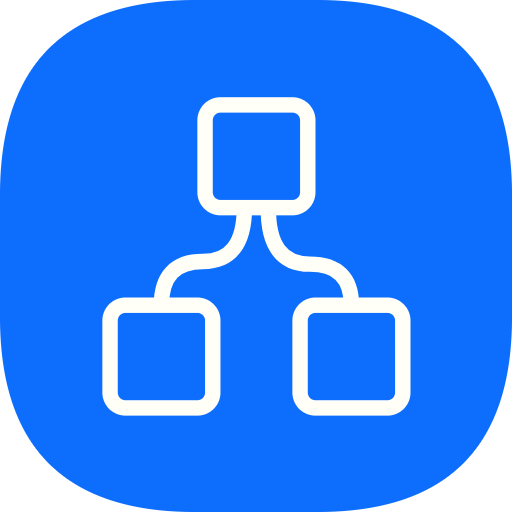

<p align="center"></p>

# Minions [](https://travis-ci.com/Kovee98/minions)  
> An app to make web worker orchestration a thing

## Getting Started
### Docker (recommended):
```
docker run -d -p 8080:80 --name minions kovee98/minions:latest
```

### Http Server
Minions is a Vue app so it can be unzipped (see [releases](https://github.com/Kovee98/minions/releases)) and served locally with your favorite http server.

## Contributing
PRs are not being accepted at this time!
